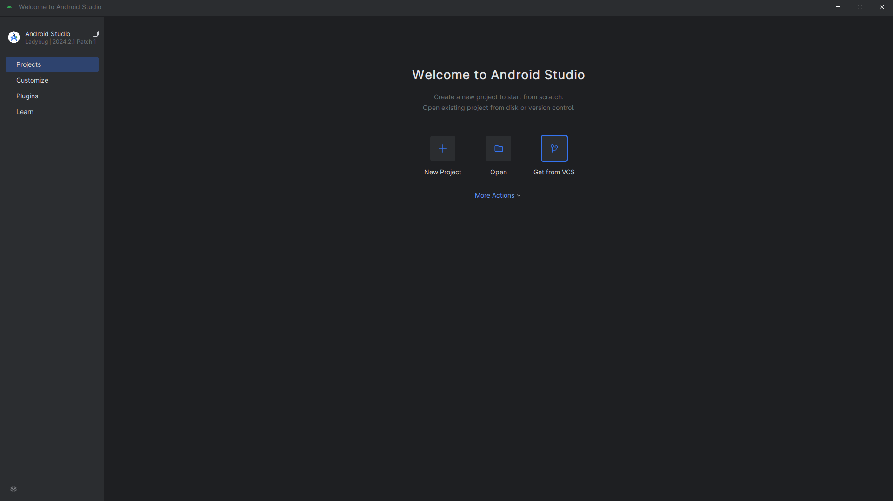
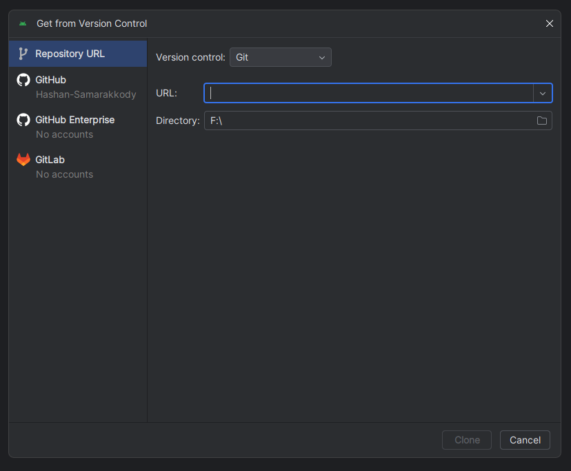
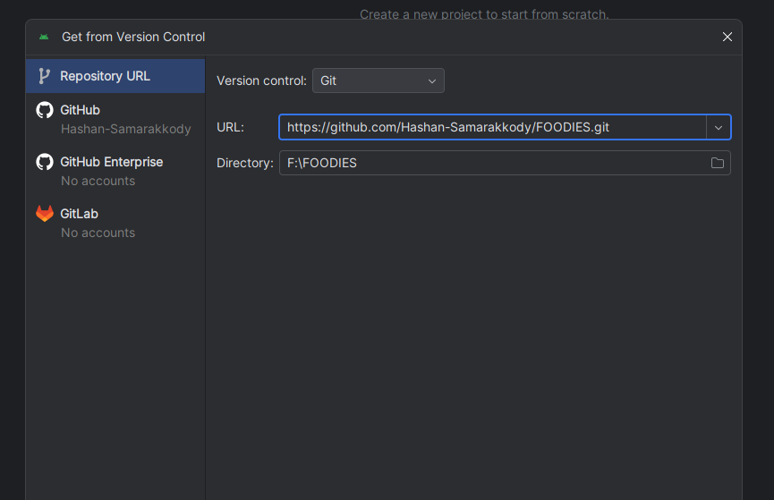
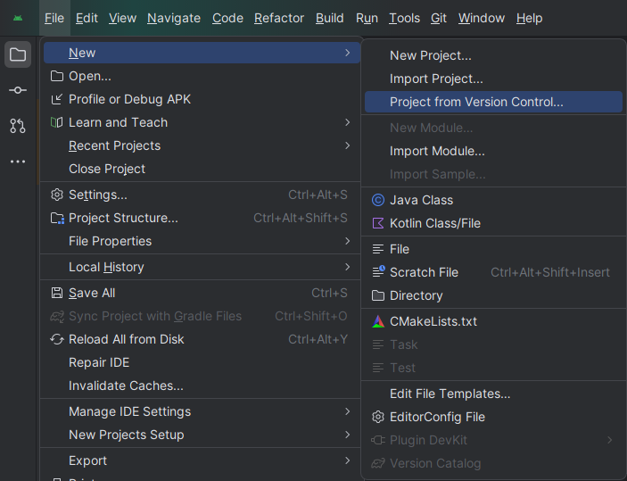
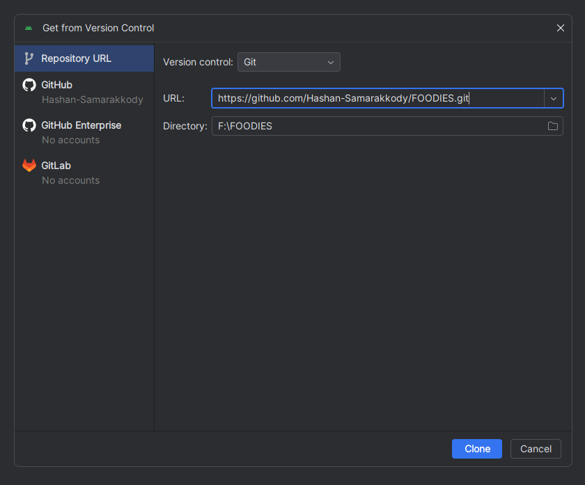

# RecipeBook - Recipe Management App

Welcome to RecipeBook, a user-friendly Android application developed for mobile application development. This project allows users to discover, share, and manage their recipe collections with ease. The application is built using Java and offers a rich set of features for a seamless cooking experience.

## Table of Contents
- [Introduction](#introduction)
- [Features](#features)
- [Prerequisites](#prerequisites)
- [Installation](#installation)
- [Usage](#usage)
- [Screenshots](#screenshots)
- [Testing](#testing)
- [Credits](#credits)

## Introduction
RecipeBook is designed to help users create, manage, and share their favorite recipes in an intuitive interface. With multimedia integration and social features, users can easily enhance their cooking journey by connecting with others.

## Features
RecipeBook includes the following key features:
- User authentication via Google
- Add, edit, and delete recipes
- Mark recipes as favorites
- Upload photos and videos with recipes
- Search for recipes by ingredients, cuisine, or difficulty
- Share recipes via social media or with other users
- User profiles for managing personal information and preferences
- Review and rating system for recipes

## Prerequisites
Before running the RecipeBook application, ensure your environment meets the following requirements:
- Android Studio installed (version X or higher)
- Android SDK (version X or higher)
- Java Development Kit (JDK) (version X or higher)

## Installation
To set up the RecipeBook application on your local machine:
1. Clone the repository:
   ```bash
   https://github.com/Hashan-Samarakkody/FOODIES.git

## Installation Steps
### These sre the installation steps of theis project using Android Studio as of November 2022 (Ladybug//2024.2.1 version)

1. Open the project in Android Studio.


2. Click on "Get from VCS" icon. Then, you will be shown a dialog box.


3. Paste the link of this repository inside that dialog box.


### If you are already opening a project, follow the below steps

   A. Navigate to "Project from Version Vontorl" as follows and click on it. 
   (File -> New -> Project from Version Vontorl)
   

   B.  Then, you will be shown a dialog box.Paste the link of this repository inside that dialog box.
   


4. Click "Clone".

5. If you are asked to set up the SDK path do that as well.

## Usage
Once the application is installed:
- Launch the RecipeBook app from your device or emulator.
- Sign in using your Google account.
- Explore the app's features, including adding, editing, and sharing recipes.

## Screenshots
Add additional screenshots as necessary.

## Testing
Conducted unit testing to ensure each component's functionality. Refinements were made based on feedback from testing. A Test Document is available in the repository.

## Credits
RecipeBook was developed as part of the INTE 22283 - Mobile Application Development course. Special thanks to all contributors for their hard work and dedication.

### Team Members:
-   _[Dinithi](https://github.com/dinithiHM)_
-   _[Koshali](https://github.com/fdo-koshali)_
-   _[Subhani](https://github.com/Subhani-dilmini)_
-   _[Lakma](https://github.com/lakma1019)_
-   _[Zahri](https://github.com/Zahri-Affa)_